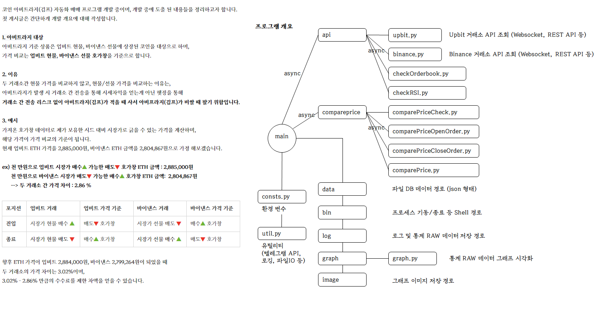

# Arbitrage (CEX Premium Trading Bot) 📈

Upbit(현물) - Binance(선물) 간 김프(Korea Premium) 차익거래 자동화 봇

## 개요

Arbitrage는 한국 거래소(Upbit)와 글로벌 거래소(Binance) 간의 가격 차이(김프, Korea Premium)를 실시간으로 모니터링하고, 수익 기회 발생 시 자동으로 차익거래를 수행하는 Python 기반 트레이딩 봇입니다.

**전략**: Upbit 현물 매수 + Binance 선물 숏 포지션을 동시에 진입하여 김프 차익을 수익화

<p align="left">
  
</p>

## 주요 기능

### 🔄 실시간 데이터 수집
- Upbit/Binance WebSocket을 통한 실시간 호가(Orderbook) 수신
- 두나무 API를 통한 실시간 달러 환율 조회
- Bithumb USDT 가격 모니터링

### 📊 김프 분석
- 진입 김프(Open Premium) / 청산 김프(Close Premium) 실시간 계산
- BTC 기준 김프 대비 알트코인 김프 비교
- RSI(15분/4시간) 지표 기반 진입 타이밍 분석
- 거래량 상위 티커 자동 선별

### 💹 자동 매매
- 분할 매수/매도 (Installment Trading)
- Trailing Stop 기반 진입/청산
- 동시 포지션 개수 제한
- 손절/익절 자동화

### 📱 텔레그램 연동
- 실시간 포지션 현황 알림
- 수익률 리포트
- 원격 명령어 지원 (`/current`, `/graph`, `/order`, `/restart` 등)

### 📈 백테스트 & 시각화
- 과거 데이터 기반 전략 백테스트
- 김프 변동 그래프 생성
- 수익률 분석

## 프로젝트 구조

```
arbitrage/
├── main.py                 # 메인 트레이딩 봇 (주문 실행)
├── collectMain.py          # 데이터 수집 전용 봇
├── commandMain.py          # 텔레그램 명령어 처리 봇
├── util.py                 # 유틸리티 함수
├── consts.py               # 설정 상수 (환경변수)
│
├── api/                    # 거래소 API 모듈
│   ├── binance.py          # Binance 선물 API & WebSocket
│   ├── upbit.py            # Upbit 현물 API & WebSocket
│   ├── bithumb.py          # Bithumb USDT 가격 조회
│   ├── hana.py             # 하나은행 환율 조회
│   ├── checkOrderbook.py   # 호가 데이터 검증
│   ├── checkRealGimp.py    # 실시간 김프 계산
│   └── checkRSI.py         # RSI 지표 계산
│
├── compareprice/           # 가격 비교 & 주문 로직
│   ├── comparePrice.py     # 김프 비교 분석
│   ├── comparePriceCheck.py    # 포지션 상태 체크
│   ├── comparePriceOpenOrder.py  # 진입 주문 로직
│   └── comparePriceCloseOrder.py # 청산 주문 로직
│
├── backtest/               # 백테스트 모듈
│   ├── backTestMain.py     # 백테스트 실행
│   ├── backTestConsts.py   # 백테스트 상수
│   ├── backTestUtil.py     # 백테스트 유틸리티
│   └── backTestLocal.py    # 로컬 백테스트
│
├── graph/                  # 시각화 모듈
│   ├── graph.py            # 그래프 생성
│   ├── graphCommand.py     # 그래프 명령 처리
│   ├── graphUtil.py        # 그래프 유틸리티
│   └── measure.py          # 측정 데이터 처리
│
├── crawl/                  # 크롤링 모듈
│   └── upbitListing.py     # Upbit 신규 상장 모니터링
│
└── bin/                    # 운영 스크립트
    ├── boot_all.sh         # 전체 프로세스 시작
    ├── shutdown_all.sh     # 전체 프로세스 종료
    ├── main_boot.sh        # 메인 봇 시작
    ├── backtest.sh         # 백테스트 실행
    └── ...
```

## 기술 스택

| 구분 | 기술 |
|------|------|
| Language | Python 3.x |
| Async | asyncio, aiohttp |
| WebSocket | websockets |
| Exchange API | pyupbit, Binance API |
| Notification | python-telegram-bot, aiogram |
| Visualization | matplotlib |
| Data Processing | pandas, numpy |
| Logging | logging (TimedRotatingFileHandler) |

## 환경 설정

### 1. 필수 패키지 설치

```bash
pip install pyupbit websockets aiohttp ujson pandas numpy matplotlib python-telegram-bot aiogram pyjwt requests cloudscraper
```

### 2. 환경 변수 설정

```bash
# Upbit API
export UPBIT_OPEN_API_ACCESS_KEY="<YOUR_UPBIT_ACCESS_KEY>"
export UPBIT_OPEN_API_SECRET_KEY="<YOUR_UPBIT_SECRET_KEY>"

# Binance API
export BINANCE_OPEN_API_ACCESS_KEY="<YOUR_BINANCE_ACCESS_KEY>"
export BINANCE_OPEN_API_SECRET_KEY="<YOUR_BINANCE_SECRET_KEY>"
```

### 3. 설정 파일 (`consts.py`)

```python
# consts.py
ENV = 'real'  # 'real' 또는 'local'

# 거래소 설정
UPBIT = 'Upbit'
BINANCE = 'Binance'
BITHUMB = 'Bithumb'
EXCHANGE_LIST = [UPBIT, BINANCE]

# 거래 설정
BALANCE = 1000000           # 총 투자금
TETHER = 1450               # 테더 기준가
POSITION_MAX_COUNT = 5      # 최대 동시 포지션

# 김프 설정
CURR_GIMP_GAP = 0.2         # 현재 진입/종료 김프 차이
OPEN_GIMP_GAP = 0.3         # 진입 김프 갭

# 텔레그램 설정
TELEGRAM_BOT_TOKEN = '<YOUR_TELEGRAM_BOT_TOKEN>'
TELEGRAM_MESSAGE_MAX_SIZE = 4096
```

## 사용법

### 메인 트레이딩 봇 실행

```bash
python main.py
```

### 데이터 수집 봇 실행

```bash
python collectMain.py
```

### 텔레그램 명령어 봇 실행

```bash
python commandMain.py
```

### Shell 스크립트로 실행 (운영 환경)

```bash
# 전체 프로세스 시작
./bin/boot_all.sh

# 전체 프로세스 종료
./bin/shutdown_all.sh

# 백테스트 실행
./bin/backtest.sh
```

## 텔레그램 명령어

| 명령어 | 설명 |
|--------|------|
| `/current` | 현재 포지션 및 수익률 조회 |
| `/graph [날짜]` | 김프 변동 그래프 생성 |
| `/order open [티커]` | 강제 진입 |
| `/order close [티커]` | 강제 청산 |
| `/set_grid [값]` | 그리드 설정 변경 |
| `/set_close [모드]` | 청산 모드 설정 |
| `/restart` | 봇 재시작 |

## 트레이딩 전략

### 진입 조건
1. 거래량 상위 티커 선별
2. 진입 김프가 특정 임계값 이하
3. BTC 김프 대비 적정 갭 유지
4. RSI 과매도 구간 아님 (4시간 RSI > 35)
5. Trailing Stop 조건 충족

### 청산 조건
1. 목표 김프 갭 도달
2. Trailing Stop 트리거
3. 손절 조건 충족
4. 강제 청산 명령

## 로그 파일

- `order.log`: 주문 실행 로그
- `premium.log`: 김프 데이터 수집 로그

로그는 날짜별로 자동 rotation되며 30일간 보관됩니다.
